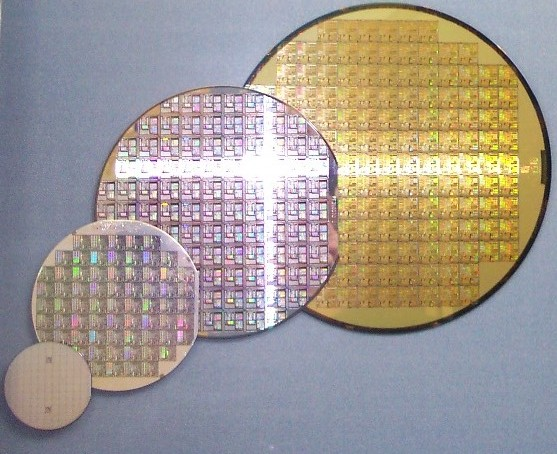
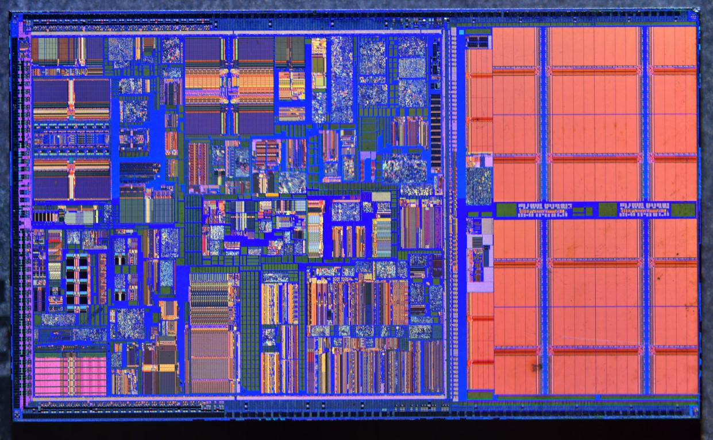
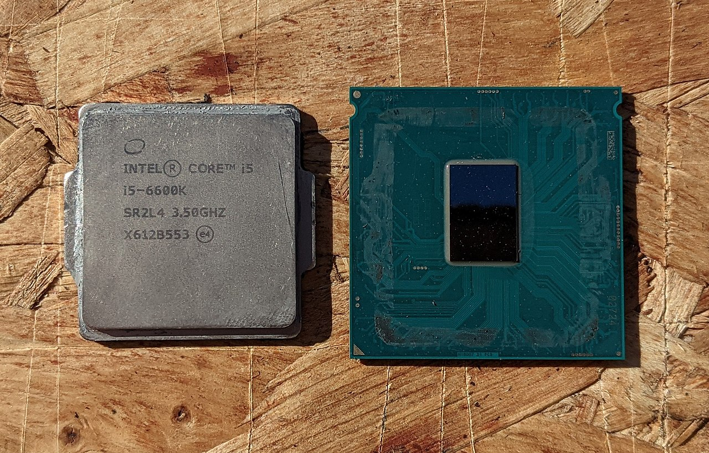
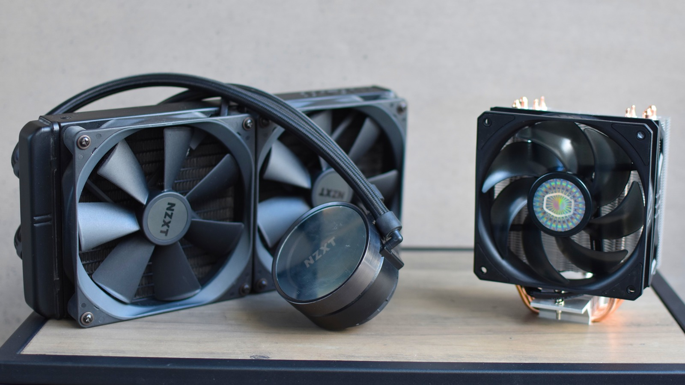
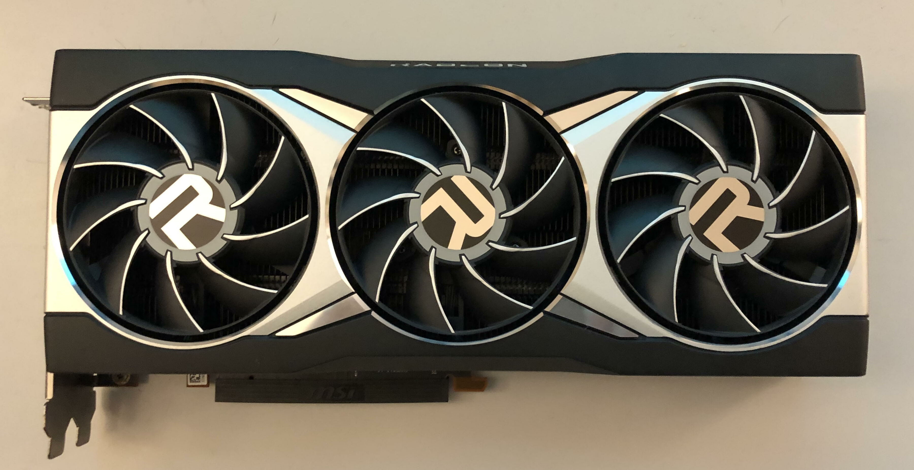
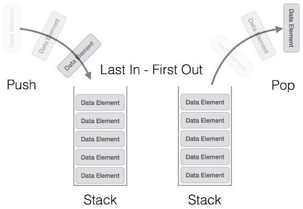
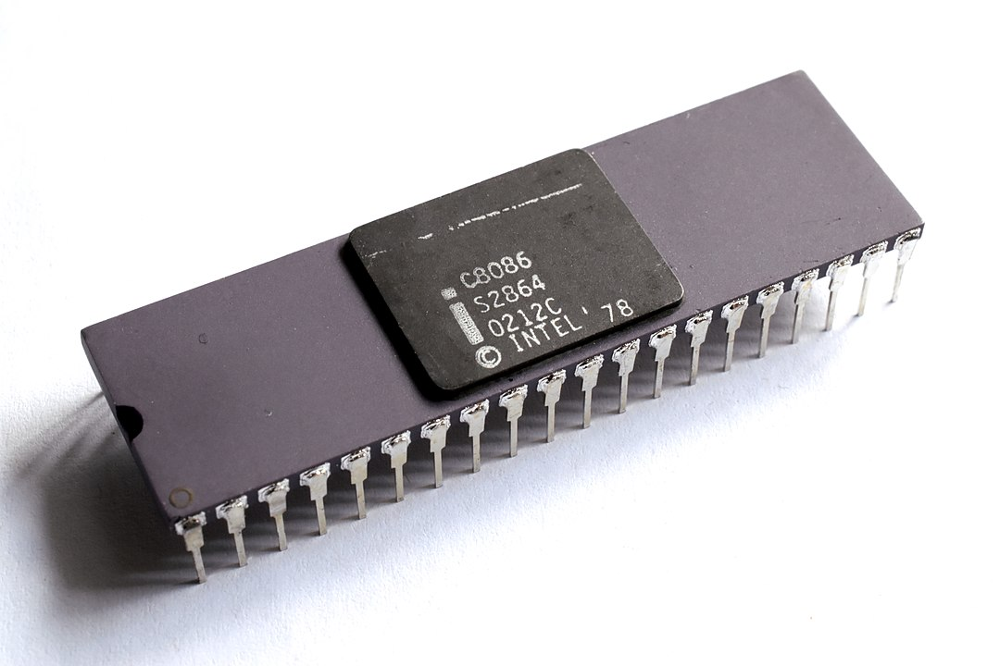
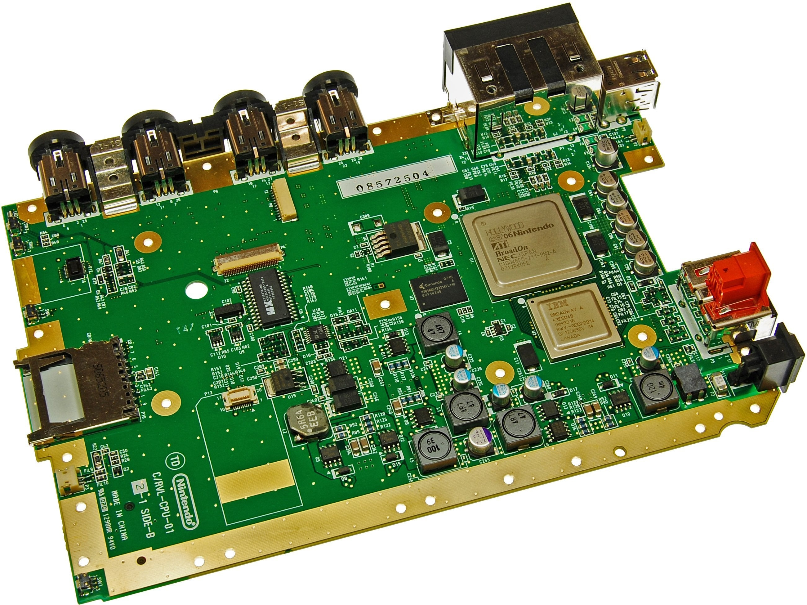
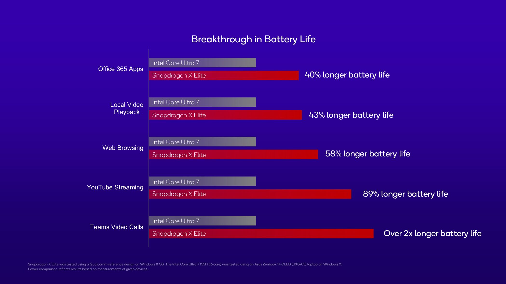

Have you thought about how a computer processor really works? Isn't it fascinating that all it really is, is just silicon, one of the most abundant elements in our crust, and can be found easily in sand. Don't know about you, but personally I've never seen the beach at Maldives randomly pulling a Fortnite default dance move!

Jokes aside, the CPU inside your computer has gone through many, many processes to turn into what it is today.

## Fabrication
Highly pure sand is required to break the chemical bonds between oxygen and silicon within the sand particles to separate them, and this is done to many tons of sand. Once the silicon is extracted, any and all impurities are removed to turn the mixture into 99.9999% pure ingots. The purer the ingot, the lesser is the chance of failure for any of the chips created from it.

*Silicon wafers cut out of ingots. These have already been divided into grids and are already etched (Source: Wikipedia)*

The ingot is then divided into thin slices called [wafers](https://en.wikipedia.org/wiki/Wafer_%28electronics%29); not the eating kind though. The rest of the process is too complicated to be covered in this topic, but in short, the wafer is divided into grids, and the CPU's pre-designed circuit traces are laser-etched on top of it using a process called [microlithography](https://en.wikipedia.org/wiki/Microlithography). The wafer is then polished and cleaned many times, and then each grid is checked for defects. Once sliced into pieces, the failed pieces are recycled by using firmware and microcode locking to reuse it into working as a lower tier chip, whereas the working chips are sent forwards to be packaged correctly.

*Die shot of Intel Pentium II Dixon. Components and traces are visible on the silicon die. (Source: SIC66SIC66)*

## Clock It
A CPU is a very complicated piece of silicon circuitry very close to magic. It is pretty much a very complicated IC microprocessor. All the components run in-sync with each other to execute instructions one at a time and run the program code correctly. All of them reset to match each other's speeds billions of times a second to execute the current instructions. This frequency is called the [clock speed](https://en.wikipedia.org/wiki/Clock_rate), which is provided as electrical pulses by the [system clock](https://en.wikipedia.org/wiki/System_time) and is measured in hertz (Hz). On each clock, one step of the fetch-decode-execute (FDE) cycle can take place.

> <dyk>The fetch-decode-execute cycle is what a CPU does to execute each instruction. The data and the instruction are fetched from where they are stored in memory, the instruction is decoded so that the correct circuit can execute the correct function, and the instruction is executed on the data given. The cycle then restarts.</dyk>

If you send these synchronizing electrical pulses faster than the clock speed, i.e. [overclock](https://en.wikipedia.org/wiki/Overclocking) your CPU, either:
1. The components could handle the higher rate of synchronization over their factory value, hence executing more instructions over one second, increasing performance, or
2. They would be unable to handle the higher clock speeds and would go out of sync, causing crashes.

Overclocking can be done by removing any power and voltage limitations to drive more electricity to the CPU (or even GPU for that matter) so that its clock speed can be increased to improve performance. However, due to the nature of electrical conductivity, a lot of this power is wasted as heat. This is not only true for overclocking, rather, powering any CPU causes a lot of heat to be released from the silicon package.

*Intel Core i5-6600K CPU with the IHS removed. The silicon die is visible. (Source: Wikimedia Commons)*

This heat is spread out to the top using a protective metal covering on the CPU called the [integrated heat spreader (IHS)](https://en.wikipedia.org/wiki/Heat_spreader). Some CPU cooling solutions cool this IHS and hence the silicon CPU by pumping liquid over it that absorbs the heat and transfers it to a radiator to cool it back down. Other cooling solutions use [heatsinks](https://en.wikipedia.org/wiki/Heat_sink) and [copper heat pipes](https://en.wikipedia.org/wiki/Heat_pipe), which are essentially hollow copper tubes with a small amount of water. A physics technique known as evaporative cooling is used to transfer heat from the IHS to the heatsink. The heatsink has hundreds of thin fins that are used to increase surface area and hence release the heat in the air more effectively. A fan is usually used to blow air through the heatsink to cool it more effectively.

*Liquid cooler on the left, air cooler on the right. (Source: [James Archer](https://www.rockpapershotgun.com/authors/james-archer))*

A CPU may idly run around at around 45ºC (113ºF), but at full CPU load, it can easily touch over 80ºC (176ºF). If the CPU gets too hot, it can damage the CPU components easily, and so a failsafe is used within the CPU itself called [thermal throttling](https://en.wikipedia.org/wiki/Dynamic_frequency_scaling) that reduces power use and hence performance to keep temperatures below a certain critical threshold, usually 110ºC (230ºF), to not damage itself.

While overclocking has a very large and dedicated community even today, the effects of overclocking have been largely reduced compared to twenty years ago, due to being factory overclocked during the manufacturing process, and due to many of them reaching over 90ºC (194ºF) regularly at stock speeds with normal load, there is not enough thermal headroom to push for higher clock speeds without damaging the CPU or crashing the computer. CPUs have been overclocked from base frequencies of 5 GHz to over 9 GHz in recent years, but it usually requires heavy industrial equipment, very specialized conditions and very skilled technicians to overclock the CPUs that much and manage those high speeds, which does not provide really any significant benefit in terms of processor speed for an end user as it can reduce the life of the CPU by significant amounts.

## Core Interruptions

"But hey, if a CPU runs instructions one at a time, why can I play games and watch videos simultaneously?" Excellent question. Modern CPUs can multitask effectively, performing many functions simultaneously. It can talk to your hardware, download updates in the background, stream videos, compile code and run games, all simultaneously without breaking a sweat.

There are two ways to run instructions simultaneously in a computer: using [multiple cores](https://en.wikipedia.org/wiki/Multi-core_processor) and using [interrupts](https://en.wikipedia.org/wiki/Interrupt).

> <tip>If you have a surface understanding of what a kernel is and want an extremely detailed explanation about how computers multi-task, [read here](https://cpu.land/slice-dat-time).</tip>

You might have heard about a CPU having "cores", and people say that more cores means better performance. Well, that is kinda true, but over a limit, neither me nor you would have any benefit of having too many cores. Cores are essentially multiple tiny CPUs inside the CPU. They can process and execute instructions one by one, and have their own dedicated ALUs, CUs and clocks to keep the components in sync, and each core is interconnected with each other using additional buses so that they can intercommunicate to avoid bugs like [race conditions](https://en.wikipedia.org/wiki/Race_condition). Each core can be allocated a certain task, known as a [thread](https://en.wikipedia.org/wiki/Thread_%28computing%29), to run the processes simultaneously, or programs can be made with [multithreading](https://en.wikipedia.org/wiki/Multithreading_%28computer_architecture%29) in mind to be able to offload different threads across multiple cores to utilize them effectively.

[Hyperthreading](https://en.wikipedia.org/wiki/Hyper-threading), a technology where two threads can be executed on the same core simultaneously, can be used to increase performance of a CPU further. While it can have its disadvantages, hyperthreading generally improves performance, but it's better to have 8 cores without hyperthreading (8 available threads) in a CPU compared to 4 cores with hyperthreading (also 8 available threads), as hyperthreading has to share resources between the two threads on the same core.

Programs can only utilize that many cores to a certain limit. Otherwise, the cores idly sit and sip power, which means you can't feel any performance gain, and you have to pay more for such a chip, to power it and to cool it too since all the cores are held within the same CPU package under the same IHS. For traditional CPUs (due to some recent chips having separate efficiency and performance cores), 8 threads are usually enough for office use, 12 for gamers and multi-taskers, and maybe 16 if you stream or do video editing. Rarely anyone uses more than this, unless you look at industrial use cases or do extremely frequent CPU-heavy tasks like rendering, although you're better off buying a dedicated [graphics card](https://en.wikipedia.org/wiki/Graphics_card) in that case.

*A modern graphics card with a heatsink and fans: AMD Radeon RX 6900 XT (Source: Verte95)*

Computers did not always have multiple cores. In fact, it was normal during the early 2000s to have just one thread to run all your tasks on. Obviously, this meant you could not multi-task as effectively, but you could multi-task. But that begs the question "If you can only run one simultaneous task on a thread, then how can a one thread system perform multiple tasks simultaneously".

The answer is using hardware interrupts. Interrupts are used to run multiple tasks pseudo-simultaneously. That means, the tasks would appear to be happening simultaneously to us but would actually be executed one by one. For example, downloading a file in the background and using a web browser. It is in the name; an interrupt is an electronic signal from a hardware device or a program that temporarily pauses a certain process to allow another task to be completed before handing the reigns over to the original task.

In the above example, imagine you are scrolling your webpage. Your network adapter receives a file (or a small packet of one, see Chapter X for more). The network adapter would flag a hardware interrupt, which the CPU will check for after finishing an ongoing FDE cycle. If the interrupt does not need immediate action, i.e. it has a lower or the same priority than the current task, the FDE cycle continues as is. Otherwise, all the data in the registers and components inside the core would be packaged and stored in a piece of memory called the [stack](https://en.wikipedia.org/wiki/Stack-based_memory_allocation). An interrupt service routine, which is a software that handles the specific interrupt, is loaded, and its instructions executed, which in this case would be to save the downloaded file. Once done, the CPU would check for another interrupt and base its priority with that of the FDE cycle package stored in the stack and repeat the process. If there is no interrupt that needs immediate handling, the package is loaded back from the stack and the original data of the FDE cycle is put back in the respective registers, and the normal cycle continues.

> <dyk> A stack is a computing data type and a piece of memory that runs using the last-in first-out (LIFO) architecture. It works like a stack of plates, in which if two blocks were put in the stack one after the other with the second block on top of the first, then to take out the first block, the second block will have to be removed first. See diagram below. </dyk>

*Concept of a stack (Source: [tutorialspoint](https://www.tutorialspoint.com/data_structures_algorithms/stack_algorithm.htm))*

While this is not running multiple tasks concurrently, all of it happens so fast that to the average end user, it feels completely normal and smooth to perform both such tasks over the same thread. However, this cannot happen to a larger scale since handling too many interrupts can cause all the tasks on a device to run very slow, which is why multiple threads are still needed in a device.

> <note>In Chapter 1, we talked about the von Neumann architecture and about the stored program concept being used in computers today. Currently, the von Neumann architecture is not the base architecture for CPUs, due to the addition of multi-core processing but the concept of having a stored-program computer with unified memory for instructions and data is the same. This is because the von Neumann architecture was based on [single instruction, single data (SISD)](https://en.wikipedia.org/wiki/Single_instruction,_single_data) architecture whereas the current computers are based on [multiple instruction, multiple data (MIMD)](https://en.wikipedia.org/wiki/Multiple_instruction,_multiple_data) architecture.</note>

## Architecture
You probably have heard the news about x86 and ARM, and how Apple's revolutionary new M series chips have excellent battery life like no other, etc. Most people do not know what they mean.

Every CPU has to have instructions to run certain low-level code in the CPU directly, with complex circuitry to perform functions quickly and with less lines of code. To have more instructions, you need more circuits within the CPU, and the CPU has to understand to decode each function separately. When CPUs were single-core, slow, and computers had limited memory, every line of code and every CPU cycle was important. Hence, CPUs started to be given many additional packages of instructions to perform complicated tasks that take many instructions into single instructions, and these packages were called instruction sets. There was an arms race (pun intended) for having the most instruction sets in a CPU, as that directly correlated to performance benefits. One such CPU was Intel's x86 line of CPUs onwards from Intel 8086 (made nearly 50 years ago!).

*Intel 8086 CPU IC (Source: Thomas Nguyen)*

A problem that came with having more instruction sets was an increased amount of power draw for certain performance, and hence increased cooling solutions, which could also mean higher noise levels due to the whirring of the fans. However, due to the demand of high performing CPUs, over 50 years, more and more instruction sets kept being added to the CPUs, even if they were rarely used. A CPU that functions with many instruction sets in mind is called a [Complex Instruction Set Computer (CISC)](https://en.wikipedia.org/wiki/Complex_instruction_set_computer) CPU. This includes every x86 chip ever built.

Software was built to utilize all these instruction sets, in which many instructions of these sets may not even be used by many people, but once added, support for them could not be removed without removing any backwards compatibility to older software, which would cause the machines to crash. Hence, CISC CPUs hence have just gotten more and more power hungry.

Amidst all this, people tried to test the theory originally moved to the side: how would a CPU perform if it had fewer instruction sets. These CPUs were called [Reduced Instruction Set Computer (RISC)](https://en.wikipedia.org/wiki/Reduced_instruction_set_computer) CPUs. It was found that these CPUs could run on very little power! Maybe it could be a saving grace for all the problems with higher power usage with CISC CPUs? Well, yes, it was, but initially, and up till 2020, RISC could not match the performance anywhere close to that of CISC CPUs.

Two companies were very popular in the RISC CPUs business: [PowerPC](https://en.wikipedia.org/wiki/PowerPC) and [ARM](https://en.wikipedia.org/wiki/ARM_architecture_family). They were families of CPUs built on the RISC architectures and had their ups and downs in terms of their efficient CPUs. For many years, power use and cooling need of CPUs had not crossed a point of worry. In terms of desktop and laptop chips, x86 was king, giving the best in class of performance, albeit not the best battery life. ARM CPUs worked by doing the same functions as x86 CPUs, but rather using multiple simpler instructions over just one, which meant seemingly more processing times, and more RAM usage to store those instructions, but realistically these simpler instructions are so optimized that many more of these can happen per cycle compared to one complex instruction in x86, and if the program is optimized correctly, it can work with the same amount of RAM too easily. However, this was not necessarily true until recently.

*The CPU for some game consoles such as the [Nintendo Wii](https://en.wikipedia.org/wiki/Wii) also used PowerPC chips as shown on the motherboard (Source: iFixit)*

ARM and PowerPC chips started to be used in mobile devices like smartphones, due to their incredibly low power use, they were perfect for such a use case. However, due to their lackluster performance, they were never even close in terms of performance to even the worst x86 chips. I will mainly talk about ARM since PowerPC is not really used in the consumer space anymore. ARM continued to evolve in the smartphone market with excellent [Qualcomm Snapdragon](https://en.wikipedia.org/wiki/Qualcomm_Snapdragon) and Apple A-series chips for mobiles, and Qualcomm did try to make extremely battery efficient laptops with their mobile chips, but they failed with incredibly bad performance, and nobody thought that ARM could have a proper foothold in the laptops market.

Everything changed with Apple's M1 chip: the first desktop class ARM chip that had incredible performance with incredible power efficiency. It wasn't quite on par with the best offerings in the x86 lineup, but it was great for decently demanding work like photo and video editing. In 2024, Qualcomm released their Snapdragon X Elite and Snapdragon X Plus chips to compete, which again promised excellent performance at much lesser power profiles than their competitors.

One of the reasons Qualcomm and Apple were able to reduce power use by so much without sacrificing was due to the fact that it has all its components, such as the CPU, integrated GPU, and other components were closely packed together on the same hardware die, with other components like RAM very close to the CPU itself. Computers and laptops with dedicated GPUs need longer traces to link these components which need more power pushed to each other to prevent signal degradation. Plus, additionally powering a dedicated GPU costs a lot of power, even though it gives much better performance. However, many Intel laptops have been trying to do the same recently, which has improved their efficiency, but its [Instruction Set Architecture (ISA)](https://en.wikipedia.org/wiki/Instruction_set_architecture) definitely plays a major role in making the CPU efficient, which can be shown with the performance gains at lower wattage for the ARM equivalent CPUs.

*Qualcomm's Claims on Snapdragon X Elite's battery life compared to comparable Intel chips (Source: Qualcomm)*

A very new architecture has been released, which is more of an open-sourced architecture, which means no licensing fees needs to be paid to the companies who own the original licenses, i.e. Intel for x86, and ARM for ARM chips. It is called RISC-V, and its implementations can have any instruction set combinations, and many of the [Big Tech](https://en.wikipedia.org/wiki/Big_Tech) companies and other Silicon Valley companies are working on expanding this architecture. It is expected to be able to beat ARM CPUs someday, but that time is still very far away since RISC-V is still at a very early stage of development, and does not have the power to even run light builds of Linux well either.