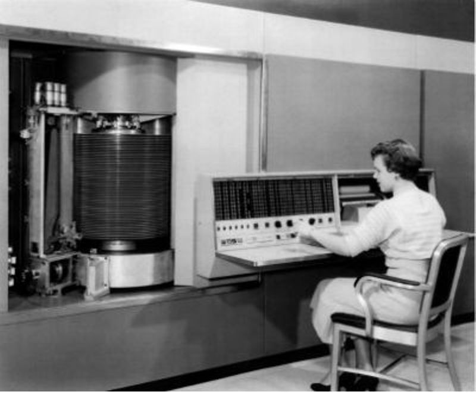
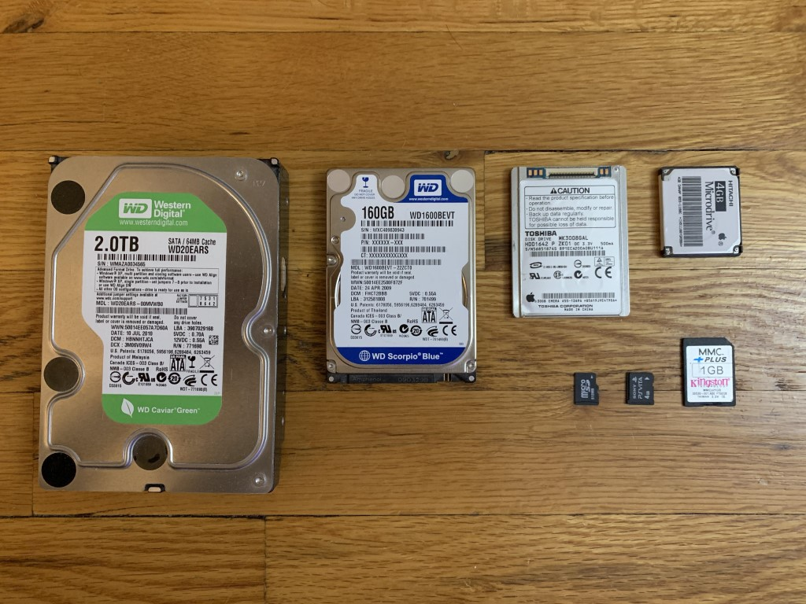
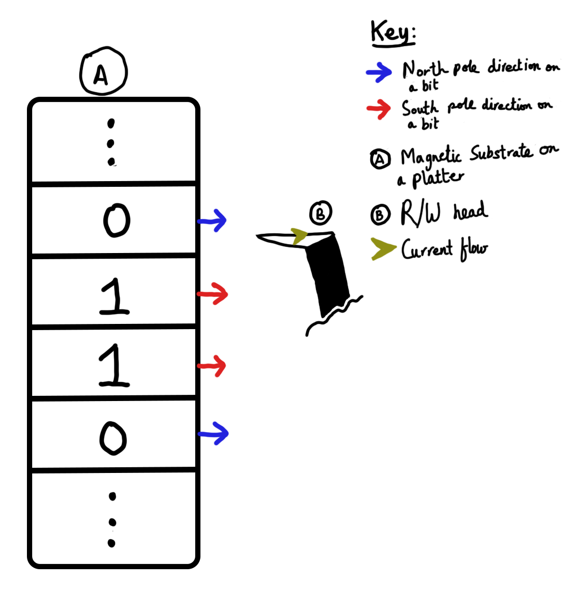
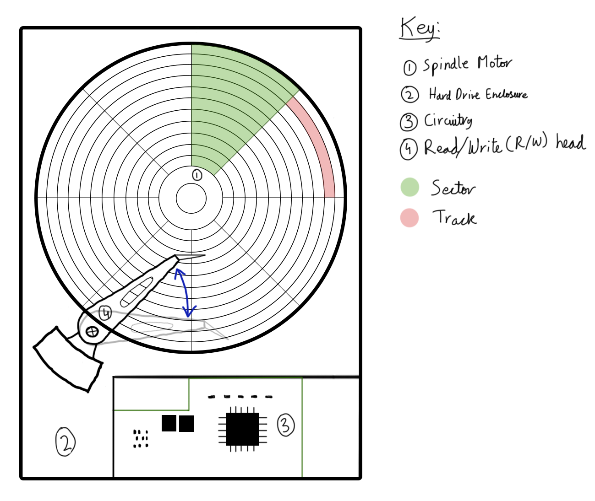
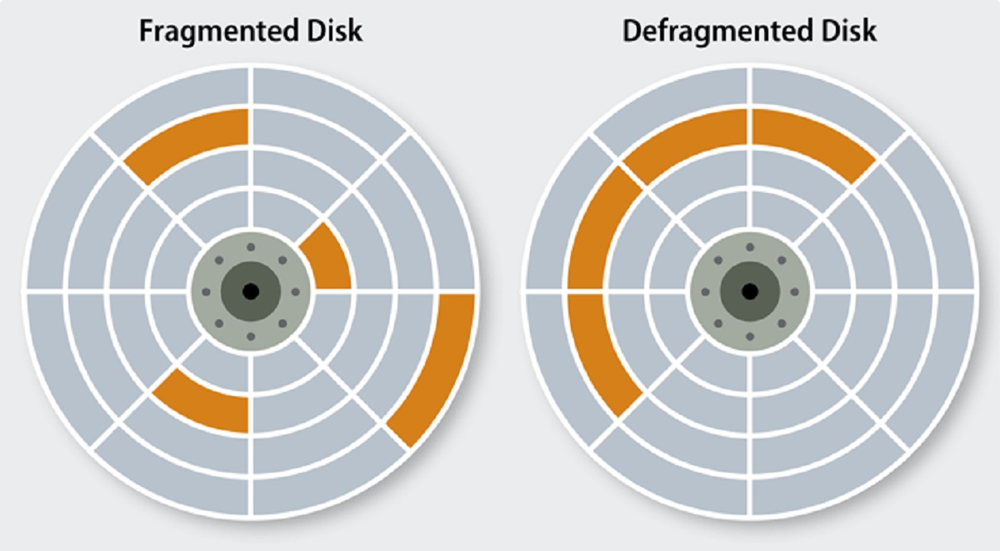
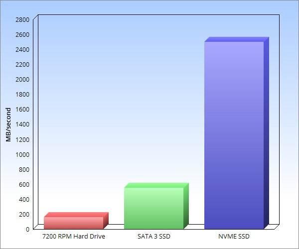

For the average consumer, the storage is the most important factor for buying a computer. Nearly every computer out on the market is good enough for most simple tasks like web browsing and media playback. People just wanna know if they can store a bajillion files in it. These files are stored to your storage.... Obviously, it's in the name.

But storage devices have so many acronyms... What do they even mean? "HDD, SSD, NVMe, SATA"... What is this mess?

> <tip>Physical storage may be referred to as secondary or tertiary storage by many people, but it means the same thing. Secondary storage consists of non-volatile memory within the computer that large amounts of data can be stored to or retrieved from, but not necessarily as frequently as from the primary memory. Tertiary storage meanwhile consists of usually external storage that could be considered "cold storage", i.e. it can store a large archive of data without leaving the storage connected to the computer.  Secondary storage is basically the collection of internal drives in your system whereas tertiary storage could mean optical discs, magnetic tapes, SD cards and USB drives.</tip>

## Physical storage
When the first computers were made, such as the Bombe talked about in Chapter 1, the mode of storing and feeding data to computers was using long rolls of physical tape. A hole at every certain set interval would mean 1, whereas having no such hole would mean 0 (or vice versa). Binary code would be made using this method on physical tape rolls, and the computer could read this "code" and execute certain functions. Storing a byte of code would functionally take more physical space back then than to store many terabytes today.

)](../assets/images/content/baudot_tape.jpg)

In physics, [Faraday's laws](https://en.wikipedia.org/wiki/Faraday%27s_law_of_induction) (and [Maxwell's equations](https://en.wikipedia.org/wiki/Maxwell%27s_equations)) have taught us about magnetism, how to induce it, and how it relates to the generation of electrical current. Engineers realized that if you had a large piece of metal which you could magnetize its [dipoles](https://en.wikipedia.org/wiki/Magnetic_dipole) differently in portions, then you could use the north pole on one side to signify a 1 bit, and a south pole on the same side to signify a 0 bit. Magnetizing dipoles in these small amounts does not take that much power either. It can also be read if a copper wire is brought close by inducing a voltage in a certain direction based on the dipole direction. The computer can read this voltage and base its bit based on the direction.

Scientists exploited these laws to create a type of data storage that stores data magnetically. It was called the [Hard Disk Drive (HDD)](https://en.wikipedia.org/wiki/Hard_disk_drive).

*The first commercially available hard drive. It had 50 platters and stored a whopping 3.75 MBs! (Source: [CHM](https://www.computerhistory.org/storageengine/first-commercial-hard-disk-drive-shipped/))*

Despite its physical size, it could store less than 4 MBs of data. That means that the very first HDD could hold maybe one audio file of the song you really like to listen today.

Soon enough, hard drive storage sizes started increasing, and their physical spaces reduced. Today, HDDs come in two sizes: 3.5 and 2.5 hard drives, where the number stands for the inches of diameter of each platter (see below), and based on that, the size of the enclosure is standard too. Today, the maximum storage size of a 3.5-inch HDD is 30 TB, which is over 8 million times than that of the very first hard drive!

*3.5-inch HDDs take a lot of space! microSD cards have much higher storage density today. (Source: [u/_TENFOUR](https://www.reddit.com/user/_TENFOUR/))*

A hard drive has certain components to function. It contains the enclosure, the electronic circuitry, and two very critical and sensitive pieces in every hard drive. [The platters with magnetic coating](https://en.wikipedia.org/wiki/Hard_disk_drive_platter), which are CD-like discs around a motor in the center that spins very fast called the spindle motor, and the read/write (R/W) head, which moves very quickly back and forth to read the magnetic dipoles on the hard drive through detecting the directions of voltages as 1s and 0s.

*How bits, poles and current flow are related on the surface of a hard drive.*

*Labelled top-down diagram of a hard-drive with Sectors and tracks.*

A hard drive usually has multiple stacked platters around the same spindle motor spinning them at 5400, 7200, 10000 or 15000 RPM speeds, with faster speeds naturally meaning faster R/W speeds. The R/W head moves back and forth above the platters to read the data magnetically. The platters in the middle are coated in ferrous oxide or magnetic cobalt alloys. Nothing, not even the R/W heads are allowed to touch the surface of the platters or that destroys them completely, which is why the heads hover just above the coatings. This is why HDDs have a lot of shock absorbers to prevent them from shaking, because if the internals touch each other, it can destroy the drive. The platters are divided into sectors and tracks which store the data in them as shown in the diagram above. These are essentially blocks in the hard drive where you can store the data in. Data is filled track-wise. However, due to many deletions and rewritings, data can get [fragmented](https://en.wikipedia.org/wiki/Fragmentation_%28computing%29) on the hard drive (see below), which means to access the same file, the computer will need to wait more so that the disk can rotate more, and the read write head can find the missing pieces for the file. To fix this, defragmentation is used that rearranges these fragmented sectors to be contiguous, making it easier for the hard drive to locate and load quickly.

*Fragmented VS. defragmented HDD platter. Note that in reality, there are many more fragments per file than shown. (Source: [George Kimathi](https://www.dignited.com/author/geokim/))*

## Solid-state
[Solid State Drives (SSDs)](https://en.wikipedia.org/wiki/Solid-state_drive) have taken up the entire consumer market today. 2.5-inch HDDs are basically obsolete due to their immensely slow speeds, and 3.5-inch HDDs are now mostly only being used for NAS systems and for backing up data in the consumer market. Even portable HDDs are being phased out for portable SSDs and larger USBs.

The reason is that not only are SSDs faster, but also smaller and less prone to physical shocks due to no moving parts, and hence are more reliable today. You can store many terabytes of storage in a fraction of the space of a 3.5-inch HDD. If SSDs are that good, why are HDDs being phased out today rather than before? Well, it's not all sunshine and rainbows... but for that, I'll need to explain how an SSD works.

SSDs use fancy chips called NAND flashes to store data, rather than using moving parts. These chips are non-volatile and hence do not lose their contents when the power is turned off, making them suitable for secondary memory. These chips are arranged in grids, with each cell of the grid being able to store one or more bits of information. The density of bits each cell can store depends on their cell level. Single-level cell (SLC) stores one bit per cell, double-level cell (DLC, not the downloadable kind) stores two bits per cell, triple-level cell (TLC) stores three bits per cell, and similarly, quad-level cell (QLC) stores four bits per cell.

The NAND flashes are made up of billions of floating gate transistors, which are tiny transistors that can trap in electrons from electric current, which means if electrons are found within the gate, it's a 0 bit, otherwise, it is simply a 1 bit. To read the data, voltages are given to their control gate transistors, and if there's a change in current flow, it signifies electrons being trapped or not, which signify the bit. To erase data completely, greater voltages are provided causing the electrons to push free.

[Diagram of a floating gate transistor and how electric charges signify the bit present.](../assets/images/content/floating_gates.png)
*Diagram of a floating gate transistor and how electric charges signify the bit present. (Source: [Anshul Rana](https://storedbits.com/author/anshul-rana/))*

> <dyk>Floating gates are insulated by insulating layers so that the electrons do not leak by conduction and hence cannot receive the current themselves. That is why the control gate is used, and based on the voltages provided to the control gate, electrons can jump on to the floating gates and get trapped, hence writing down a 0 bit. Based on the charges due to trapped electrons and changes to the electric field, the voltage when passed over the control gate will change signifying the presence of trapped electrons and hence the bit present.</dyk>

Due to being contained within tiny chips, and due to the ever-shrinking transistor sizes due to [Moore's Law](https://en.wikipedia.org/wiki/Moore%27s_law), the density of each NAND chip is so much that it can store terabytes within the same chip. This increases portability and storage densities of drives by magnitudes. The failure rate and risk of physical damage is also reduced due to no present moving part, and due to just having a small chip on a piece of plastic for the most part, it adds negligible weight to your system, especially in the case of a laptop, whereas even 2.5-inch HDDs weighed around 200g. And since the circuitry and read-write operations are controlled by electric current, NAND flashes have insanely high speeds which even the fastest interfaces today cannot meet. Due to not using tracks and being controlled electrically, all cells can be accessed at the same time and hence defragmentation is not an issue with SSDs.

When SSDs were first introduced, they were given the same interface as HDDs originally used for better compatibility: [Serial ATA (SATA)](https://en.wikipedia.org/wiki/SATA). SATA, being built for HDDs in mind, had a maximum transfer speed of 600 MB/s, whereas HDDs normally ran at under 200 MB/s speeds at their best. Using SATA for SSDs meant that the drives ran at a maximum speed of 600 MB/s all the time and had potential for a lot more. A computer normally has many lanes for a slot called [Peripheral Component Interconnect Express (PCIe)](https://en.wikipedia.org/wiki/PCI_Express) which sometimes were left unused. In comparison to SATA, however, using only a couple lanes, it could have blazing fast speeds. PCIe lanes were used by computer engineers to create a standard called [Non-Volatile Memory Express (NVMe)](https://en.wikipedia.org/wiki/NVM_Express), which are currently limited by the maximum speed of PCIe itself. However, it is more than enough for any computer and all consumers using their devices, with speeds ranging up to 8000MB/s, over 13 times more than SATA, and nearly 40 times that of an HDD!

*Speed comparisions of an average HDD vs. SATA SSD vs. NVMe SSD. (Source: [Howard Fosdick](https://opensource.com/users/howtech))*

However, everything that glitters is not always gold. There are a few limitations to using SSDs that have been reducing for us consumers as technology progresses but is a driving force to why HDDs are still alive today. Perhaps most importantly, SSDs are magnitudes more expensive per gigabyte than HDDs, especially at higher speeds, due to being a relatively newer and more complex technology. SSDs need to have DRAM cache to maintain higher speeds for longer times that are used to store locations of frequently accessed files similar to how CPU cache is used to store frequently used data from the RAM (read Chapter 3: Memories). These DRAM costs are added on top of the already complex circuitry and NAND chips, making SSDs quite a bit more expensive!

> <dyk>When data has to be requested by the computer, it fetches data from many places at once, rather than sequentially from contiguous cells. This random search through the cells to retreive data can be slow, and hence DRAM is required to index these cells of data so that the location for the data can be looked up immediately from this cache reducing retrieval times of the data by hundreds of magnitudes and increasing this "random read/write" speed by a lot.  DRAM-less SSDs are usually very slow in day-to-day use, and work much like an HDD instead, so it is never recommended to use such a drive.</dyk>

Another problem is that NAND cells within the flash chips can only be overwritten so many times before the floating gate transistors become too weak to be able to hold electrons, and that renders the block of cells useless to be written to, that damages the lifespan of the drive. Some SSDs cannot be kept unpowered over multiple years either due to the floating gate transistors being susceptible to degradation and losing their electron state, unlike HDDs that can be kept untouched over years, and hence are not recommended for extremely long-term backups. Due to being completely electronic, data recovery from damaged SSDs is much more difficult than that from damaged HDDs too. Another issue, specifically for NVMe SSDs, is that you can only connect as many NVMe SSDs to a computer as there are PCIe lanes available on the CPU, since each drive takes 4 lanes. However, you can connect as many SATA drives (HDDs mostly) as you have SATA ports on your motherboard, and you can add many more using PCIe expansion cards, allowing a computer to have more storage with HDDs overall than with NVMes overall.

There have been some attempts to solve these problems, such as wear-leveling to spread out write and erase operations to prevent the cell from wearing out prematurely. Over-provisioning is another technique, which is to include extra unused storage capacity on the drive that the user cannot access directly. Once cells get worn out, the drive automatically switches out the dying cells for fresh ones, extending the overall lifespan of the SSD. There are still trade-offs for a lot of cloud infrastructure and backup systems to switch completely to SSDs, though, since small cost differences even add up a lot for them, and they can achieve good enough speeds using other redundancy and other special hardware, and reliability is not a problem due to having the servers be stored in large datacenters that are not moved.

If you, however, as a consumer, have a hard drive in your system, definitely change it to an SSD as soon as you can as the trade-offs are easily worth the benefits to your laptop or PC. Just switching one drive for the other, even for a SATA SSD, can give a dying computer new life.